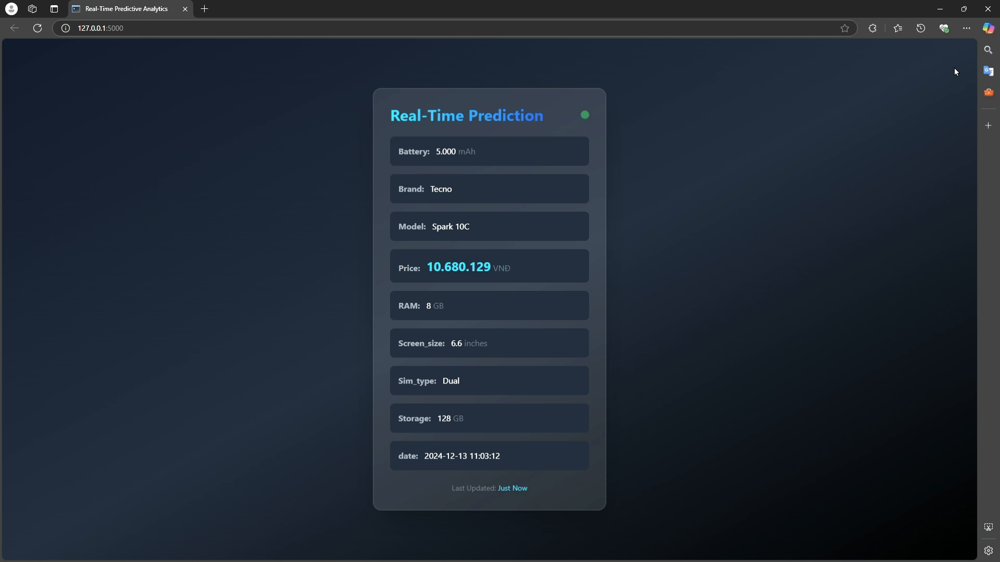

# Smartphone Prediction Project

<p align="center">
  
</p>

## Thành viên nhóm
| Họ và tên       | Mã sinh viên |
| ----------------- | -------------- | 
| Nguyễn Tiến Khôi | 22022658     | 
| Nguyễn Minh Hiếu   | 22022609     | 
| Tống Duy Tân   | 22022538     | 
| Quản Xuân Sơn | 22022519     |
| Nguyễn Quốc Tuấn | 22022553     |

## How to run 

### Prerequisites

Make sure you have the following installed on your system:

- **Python 3.8 or higher**
- **Java 8**
- **Apache Kafka**
- **Hbase**
- **Hadoop**

> Additional requirements will be installed using the provided `requirements.txt` file.

---

### Steps to Run the Project

#### 1. Clone the Repository

```bash
git clone https://github.com/WelsneilT/Big-Data-Project.git
```

#### 2. Install Dependencies

Run the following command to install all required Python packages:

```bash
pip install -r requirements.txt
```

#### 3. Run the Command Batch File

The batch file initializes Kafka, Hadoop, and HBase services required for the project.

```bash
cd Big-Data-Project
./commands.bat
```

#### 4. Start the Streaming Pipeline

Navigate to the directory containing the streaming pipeline script and execute it:

```bash
cd Main/Lambda/Stream_layer/
python stream_pipeline.py
```

#### 5. Start the Real-Time Flask Web App

Navigate to the directory containing the Flask application and run the app:

```bash
cd Main/Lambda/real_time_web_app(Flask)/
python app.py
```

#### 6. Access the Web App

Once the Flask server is running, open your browser and visit:

```
http://localhost:5000
```

---

### Notes

1. Ensure that Kafka and other dependencies are properly configured before running the `commands.bat` file.
2. You must running with administrator permission.
3. You must edit the paths in the `commands.bat` file to match the installation directories of Kafka and HBase on your machine.
4. You can check if all services are running by `jps` when running `commands.bat`.
5. All services must be up and running to avoid connection issues.


---
### Dataset

[link to dataset including 10,000,000 samples](https://drive.google.com/file/d/1OzVRCh9y0fFKOrlGUhsry7LksdCXkJJF/view?usp=sharing)


